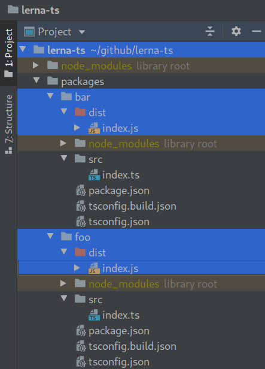

<!--suppress HtmlDeprecatedAttribute -->
<div align="center">


Template project for setting up a TypeScript monorepo

[](https://travis-ci.com/NiGhTTraX/ts-monorepo)

</div>

----

<!-- START doctoc generated TOC please keep comment here to allow auto update -->
<!-- DON'T EDIT THIS SECTION, INSTEAD RE-RUN doctoc TO UPDATE -->
**Table of content**

- [Features](#features)
- [Setup](#setup)
- [Docs](#docs)
- [Examples](#examples)
  - [ts-node](#ts-node)
  - [Babel](#babel)
  - [webpack](#webpack)
  - [jest](#jest)
  - [create-react-app](#create-react-app)
  - [NextJS](#nextjs)

<!-- END doctoc generated TOC please keep comment here to allow auto update -->

## Features

The main focus of this repo is making the `Go to definition` feature in IDEs work without any surprises, meaning it will work after a fresh clone without needing to build the project.


The secondary focus is to remove surprises when publishing packages. The repo is set up so that each package gets a clean build output without any artifacts from other packages.




## Setup

This repo uses [yarn workspaces](https://classic.yarnpkg.com/en/docs/workspaces/) and [Lerna](https://lerna.js.org/). I recommend `yarn` for monorepos due to its easier setup, but everything here works with `npm` and `lerna bootstrap` as well and you can check that out in the [`npm` branch](https://github.com/NiGhTTraX/ts-monorepo/tree/npm).

```
yarn install
```


## Docs

See the following blog posts:

- [How to set up a TypeScript monorepo and make Go to definition work](https://medium.com/@NiGhTTraX/how-to-set-up-a-typescript-monorepo-with-lerna-c6acda7d4559)
- [Making TypeScript monorepos play nice with other tools](https://medium.com/@NiGhTTraX/making-typescript-monorepos-play-nice-with-other-tools-a8d197fdc680)

If you're looking for the project references solution checkout the [`project-references`](https://github.com/NiGhTTraX/lerna-ts/tree/project-references) branch.

## Examples

This repo contains full examples of integrating with other tools and frameworks that need to be made aware that they're working with a monorepo. You can find each example in the `examples/` folder.

### ts-node

Use [tsconfig-paths](https://www.npmjs.com/package/tsconfig-paths) to resolve the path aliases at runtime:

```json
{
  "scripts": {
    "start": "ts-node -r tsconfig-paths/register src/index.ts"
  }
}
```

See the full example [here](examples/ts-node).

### Babel

Use [babel-plugin-module-resolver](https://www.npmjs.com/package/babel-plugin-module-resolver) to resolve the path aliases:

```js
module.exports = {
  presets: [
    ["@babel/preset-env", { targets: { node: "current" } }],
    "@babel/preset-typescript",
  ],

  plugins: [
    [
      "module-resolver",
      {
        alias: {
          "^@nighttrax/(.+)": "../\\1/src",
        },
      },
    ],
  ],
};
```

See the full example [here](examples/jest-babel).

### webpack

Use [tsconfig-paths-webpack-plugin](https://www.npmjs.com/package/tsconfig-paths-webpack-plugin) to resolve the path aliases:

```js
const TsconfigPathsPlugin = require("tsconfig-paths-webpack-plugin");

module.exports = {
  resolve: {
    plugins: [new TsconfigPathsPlugin()]
  }
};
```

See the full example [here](examples/webpack).

### jest

If you use `Babel` then see [this example](examples/jest-babel) from the [Babel](#babel) section above.

If you use [ts-jest](https://github.com/kulshekhar/ts-jest) then you can use its `pathsToModuleNameMapper` helper: 

```js
const { pathsToModuleNameMapper } = require("ts-jest/utils");
const { compilerOptions } = require("../../tsconfig.json");

module.exports = {
  preset: "ts-jest",

  moduleNameMapper: pathsToModuleNameMapper(compilerOptions.paths, {
    // This has to match the baseUrl defined in tsconfig.json.
    prefix: "<rootDir>/../../",
  }),
};
```

See the full example [here](examples/jest-tsjest).

### create-react-app

Use [react-app-rewired](https://www.npmjs.com/package/react-app-rewired) to extend CRA's webpack config and apply the [tsconfig-paths-webpack-plugin](https://www.npmjs.com/package/tsconfig-paths-webpack-plugin):

```js
const TsconfigPathsPlugin = require("tsconfig-paths-webpack-plugin");

module.exports = (config) => {
  // Remove the ModuleScopePlugin which throws when we
  // try to import something outside of src/.
  config.resolve.plugins.pop();

  // Resolve the path aliases.
  config.resolve.plugins.push(new TsconfigPathsPlugin());

  // Let Babel compile outside of src/.
  const oneOfRule = config.module.rules.find((rule) => rule.oneOf);
    const tsRule = oneOfRule.oneOf.find((rule) =>
      rule.test.toString().includes("ts|tsx")
    );
  tsRule.include = undefined;
  tsRule.exclude = /node_modules/;

  return config;
};
```

See the full example [here](examples/cra).


### NextJS

Use [next-transpile-modules](https://www.npmjs.com/package/next-transpile-modules) to tell NextJS to compile your dependencies:

```js
const path = require("path");

const withTM = require("next-transpile-modules")(
  // All of the packages will resolve to our monorepo so we can match that path.
  [path.resolve(__dirname, "..")]
);

module.exports = withTM();
```

See the full example [here](examples/nextjs).
