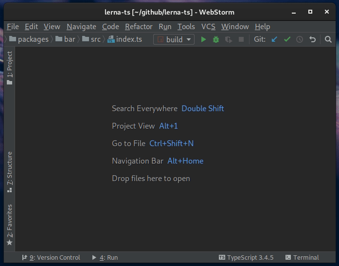

> Example TypeScript monorepo with Lerna

----

## Features

- `Go to definition` works without building the project.
- Building packages creates the expected `dist/` folder structure.
- Minimal maintenance of config files.

